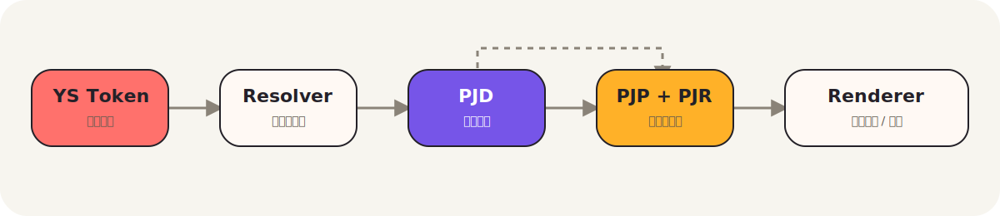
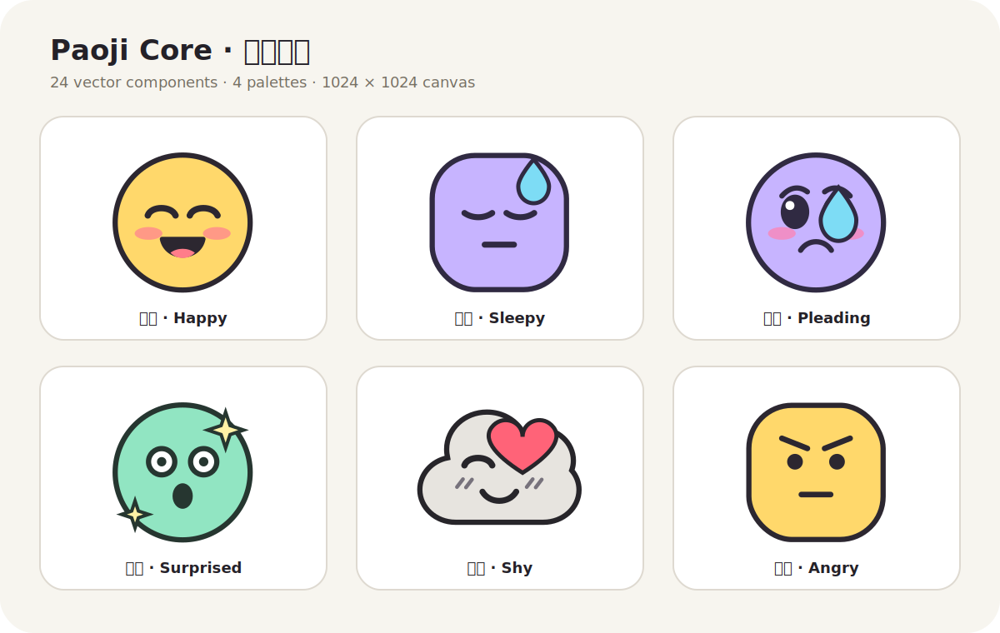

<div align="center">
  

  <br/>

  **告别固定列表，拥抱无限表达。**

  <sub>Leave the fixed list behind, embrace infinite expression.</sub>

  <br/>

  [](https://hello-yunshu.github.io/Paoji/)
  [](https://hello-yunshu.github.io/Paoji/paoji_wiki.html#protocol/01_protocol_overview.md)
  [](LICENSE)
  [](README.en.md)

  <sub>
    <a href="https://hello-yunshu.github.io/Paoji/">官网</a> ·
    <a href="https://hello-yunshu.github.io/Paoji/paoji_wiki.html">Wiki</a> ·
    <a href="https://hello-yunshu.github.io/Paoji/docs.html">文档索引</a> ·
    <a href="README.en.md">English</a>
  </sub>
</div>

<br/>

## Paoji 是什么

Paoji 是一套**开放式、可扩展的表情对象协议**。它不试图再增加一批 emoji，而是定义一种通用方式，让表情能够被创造、组合、分享、解析、验证、渲染，并在能力不足的客户端上安全降级。

> **Paoji = 短码入口 + 表情文档 + 组件包生态 + 注册表 + 渲染器 + 降级机制。**

传统 emoji 依赖中心化字符标准：新增周期长、表现能力有限，用户也很难创造一个可跨平台传播的新表情。Paoji 将表情从"固定字符"提升为"可扩展对象"，同时保留短文本易复制、可回退的优点。

---

## 它如何工作

<div align="center">
  
</div>

```text
YS Token  →  Resolver  →  PJD  →  PJP / PJR  →  Renderer  →  Visual / Fallback
```

1. **YS Token** — 可复制、可识别、可校验的短文本入口。
2. **Resolver** — 解析入口并定位对应的 PJD、资源包与版本。
3. **PJD** — 描述表情结构、语义、依赖和降级信息。
4. **PJP / PJR** — 提供组件资源，以及版本、哈希和信任索引。
5. **Renderer** — 验证并组合资源，输出 SVG、PNG 或动态表情；不兼容时回退到 Visual Hint 或替代文本。

---

## 核心对象

| 对象 | 全称 | 作用 |
|---|---|---|
| **YS Token** | 短码入口 | 传播、识别、校验与寻址 |
| **PJD** | Paoji Document | 描述表情的结构、语义、依赖与 fallback |
| **PJP** | Paoji Pack | 封装组件、材质、动画、字形与主题资源 |
| **PJR** | Paoji Registry | 提供资源发现、版本、哈希、信任与生命周期索引 |
| **Renderer** | 渲染器 | 解析、验证、沙箱化、组合、缓存与降级显示 |

---

## 官方核心表情库

仓库已包含首个实验性 [`paoji.core`](packs/paoji-core/README.md) 组件包——不是成品贴图合集，而是一组能由 Renderer 自由叠加的最小表情元素：

<div align="center">
  
</div>

| 类型 | 数量 | 内容 |
|---|---:|---|
| 基础脸型 `base` | 3 | 圆脸、柔方脸、云朵 |
| 眼睛 `eye` | 6 | 圆点、开心、困倦、恳求、惊讶、眨眼 |
| 眉毛 `brow` | 3 | 柔和、担忧、生气 |
| 嘴型 `mouth` | 6 | 微笑、开口笑、委屈、平静、惊讶、猫嘴 |
| 面部与装饰 `cheek / deco` | 6 | 腮红、害羞线、爱心、泪滴、汗滴、闪光 |
| 色板 `palette` | 4 | 暖阳、淡紫、薄荷、单色 |

所有组件均为 `1024 × 1024` 透明 SVG，无脚本、无外部字体、无网络依赖。查看 [Core Pack 说明](packs/paoji-core/README.md) 或直接打开 [manifest](packs/paoji-core/manifest.json)。

---

## 设计原则

- **短入口，无限扩展** — Token 只负责传播，复杂能力进入 PJD、PJP 和 Registry。
- **同构生态** — 官方与用户组件使用同一格式，差异体现在 trust level，而不是技术特权。
- **可验证** — 组件必须声明 namespace、version、hash、license 与 requires。
- **可降级** — 复杂能力必须有 fallback；旧 Token 不应因新版本出现而失效。
- **渐进兼容** — 从只显示 Visual Hint，到完整材质、动画和高级组件渲染。
- **本地化友好** — 协议字段保持稳定，界面、文档、语义与 alt 文本可本地化。

---

## 当前阶段

Paoji `v0.7.0` 目前仍以**协议与生态设计规范**为主。仓库已提供实验性的官方 Core Pack；参考 Renderer、正式 JSON Schema、兼容测试套件与 SDK 仍属于后续实现路线，当前不宣称生产可用。

| 能力 | 状态 |
|---|---|
| 协议概念与核心对象 | 设计文档已形成 |
| PJD / PJP / Payload 结构 | 草案已形成 |
| 组件生态、Registry 与安全治理 | 草案已形成 |
| API、测试与兼容策略 | 草案已形成 |
| 官方 Core Pack | `0.1.0 experimental`，24 组件 + 4 色板 |
| 参考 Renderer、正式 Schema 与 SDK | 规划中 |
| Paoji v1 稳定规范 | 长期目标 |

完整计划见 [实现路线图](https://hello-yunshu.github.io/Paoji/paoji_wiki.html#reference/16_implementation_roadmap.md)。

---

## 从哪里开始

| 你的角色 | 推荐阅读 |
|---|---|
| 第一次了解 Paoji | [协议总览](https://hello-yunshu.github.io/Paoji/paoji_wiki.html#protocol/01_protocol_overview.md) → [FAQ](https://hello-yunshu.github.io/Paoji/paoji_wiki.html#meta/20_faq.md) |
| 协议或客户端开发者 | [YS Token](https://hello-yunshu.github.io/Paoji/paoji_wiki.html#protocol/02_ys_token.md) → [PJD](https://hello-yunshu.github.io/Paoji/paoji_wiki.html#protocol/03_pjd_document.md) → [Renderer](https://hello-yunshu.github.io/Paoji/paoji_wiki.html#schemas/12_renderer_resolver.md) |
| 组件设计师 | [组件生态](https://hello-yunshu.github.io/Paoji/paoji_wiki.html#components/05_component_ecosystem.md) → [设计师指南](https://hello-yunshu.github.io/Paoji/paoji_wiki.html#components/06_designer_guide.md) → [检查清单](https://hello-yunshu.github.io/Paoji/paoji_wiki.html#components/15_designer_checklist.md) |
| Pack / Registry 实现者 | [PJP](https://hello-yunshu.github.io/Paoji/paoji_wiki.html#protocol/04_pjp_pack.md) → [Registry 安全](https://hello-yunshu.github.io/Paoji/paoji_wiki.html#registry/07_registry_security.md) → [治理](https://hello-yunshu.github.io/Paoji/paoji_wiki.html#registry/14_governance_registry.md) |
| 贡献者 | [路线图](https://hello-yunshu.github.io/Paoji/paoji_wiki.html#reference/16_implementation_roadmap.md) → [贡献指南](https://hello-yunshu.github.io/Paoji/paoji_wiki.html#meta/21_contribution_guide.md) |

---

## 仓库结构

```text
Paoji/
├── docs/
│   ├── index.html        # 官网主页（GitHub Pages 入口）
│   ├── docs.html         # 文档索引页
│   ├── paoji_wiki.html   # Wiki 文档阅读器
│   ├── assets/           # 核心品牌与协议视觉资源
│   ├── en/               # 英文版文档镜像
│   ├── protocol/         # Token、PJD、PJP 与协议基础
│   ├── components/       # 组件生态、Schema 与设计指南
│   ├── schemas/          # Payload、Resolver 与 Renderer
│   ├── registry/         # 注册表、安全与治理
│   ├── examples/         # 示例和本地化
│   ├── reference/        # API、路线图与兼容测试
│   └── meta/             # 术语、FAQ、授权与贡献
├── packs/                # 官方 PJP 组件包（含 paoji.core）
├── locales/              # zh-CN / en-US 本地化资源
├── package.json          # 项目元数据与发布清单
└── LICENSE               # MIT License
```

---

## 语言与贡献

Paoji 的文档与生态支持中英双语（`zh-CN` / `en-US`），后续可扩展更多语言。协议字段与标识符不本地化；面向人的文档、UI、语义和替代文本应支持本地化。

欢迎设计师、协议作者、客户端开发者、安全研究者和翻译贡献者参与。提交前请阅读 [贡献指南](https://hello-yunshu.github.io/Paoji/paoji_wiki.html#meta/21_contribution_guide.md)。协议、文档和网页原型采用 [MIT License](LICENSE)；第三方资源包可以声明独立许可证。

<br/>

<div align="center">
  <sub>
    Paoji v0.7.0 · 中英双语 · MIT License ·
    <a href="https://hello-yunshu.github.io/Paoji/">官网</a> ·
    <a href="README.en.md">English README</a>
  </sub>
</div>
